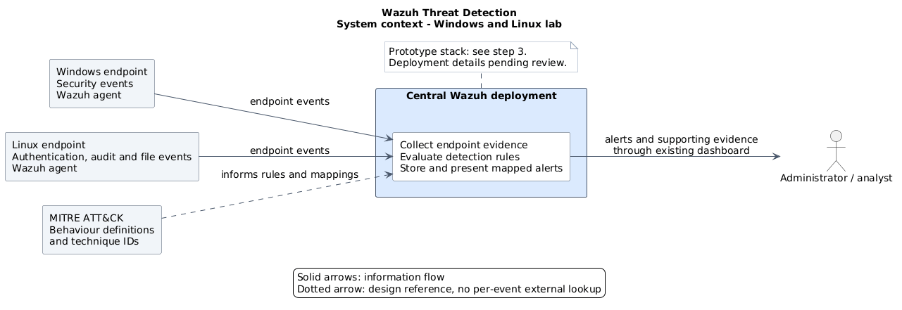

# 1. Context Analysis

> Written before any of the lab existed and left as submitted, so it reads as a proposal
> throughout. What was actually built is in
> [04-implementation/README.md](../04-implementation/README.md), and where the two disagree the
> implementation is what happened.

## My understanding of the project

My task is to implement threat detection with Wazuh across a Windows and a Linux machine, and to use MITRE ATT&CK to select the behaviours to detect and explain the resulting alerts.

## Proposed environment

I propose a controlled lab with one Windows machine, one Linux machine, and a central Wazuh deployment. My initial focus is login activity, local account creation, and scheduled tasks or jobs.

These areas cover attempts to access accounts, and behaviours that can help maintain access or recurring execution. Each has a Windows and Linux equivalent that I can demonstrate using built-in system functions.

## Role of Wazuh

I plan to use Wazuh to collect security events from both machines, analyse them centrally, and review the resulting alerts. It is an open-source platform with SIEM and XDR capabilities. [This is the Wazuh overview as per the Getting Started documentation](https://documentation.wazuh.com/current/getting-started/index.html).

The main components I will be working with are:

| Component | Responsibility |
| --- | --- |
| Agent | Runs on each monitored machine and collects the configured logs and events. |
| Server / manager | Extracts fields from events, checks detection rules, and generates alerts. |
| Indexer | Stores alerts so they can be searched and retrieved. |
| Dashboard | Provides the interface for reviewing alerts, supporting evidence, and ATT&CK mappings. |

## Role of MITRE ATT&CK

MITRE ATT&CK connects detections to documented attacker behaviour. A tactic describes an attacker's objective; techniques and sub-techniques describe the methods used. I will use these terms to explain what each detection looks for.

Wazuh ships with ATT&CK mappings on its built-in rules, and a custom rule declares its technique with a `<mitre>` block containing the technique ID. I will check the built-in rules against my scenarios first and only write custom rules where there is an actual gap.

## What this means for the implementation

- I need to verify event collection and rule behaviour before claiming a detection works.
- Windows and Linux need separate tests because their event sources and some technique mappings differ.
- Account creation and scheduled jobs can be legitimate. Alerts need context for an analyst to assess them.
- I will limit coverage claims to the procedures and conditions I test.

## System context

Detailed architecture will follow research and review of the prototype stack.

## Approach

I will focus on backend configuration and detection logic, with concise documentation and script output.
