# Wazuh lab: complete project architecture

**Implementation snapshot: 22 September 2026.** This describes the repository as it stands after the packaging phase, and the deployment recorded in the project documentation. It does not claim a fresh live verification. The diagrams include the detection lab, the Windows control dashboard, the modelling extension, and the paths that remain unfinished.

Open [Wazuh-Project-Architecture.html](Wazuh-Project-Architecture.html) to switch between diagrams, zoom, pan and download SVG or Mermaid source. It is also the file to send: every diagram, style, control and download is embedded, so it needs nothing else to open on another machine.

The numbered `.mmd` files are the source. The fenced blocks below and the pictures inside the HTML are both written from them by `build-architecture.py`, so edit the `.mmd`, run that, and commit all three. `build-architecture.py --check` says whether they currently agree and is the thing to run before a commit that touches a diagram. Standalone SVG files are not kept: they existed three times over, once per file, once inlined in the HTML and once here, for 460 KB of a 2 MB clone. The HTML has a download button for each one.

Solid arrows mean an implemented data flow, command, or dependency. Dotted arrows mean a reference, an offline artefact transfer, or a dependency explicitly labelled pending. Amber nodes identify known limitations or unfinished components. Blue nodes are application logic, green nodes are stored data, and grey boundaries group infrastructure or execution environments.

## 1. Entire project

This view connects the three major paths. Endpoint detection runs in Wazuh. The local dashboard controls the VMs and reads operational data. Model training runs separately on the workstation, then supplies a small scorer to the dashboard's manager-side status script.

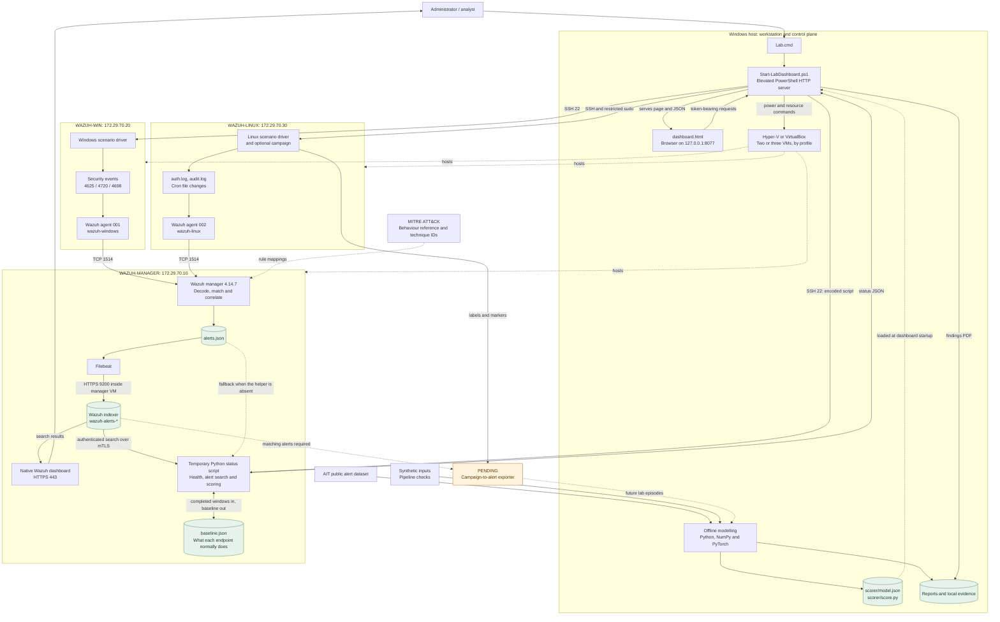

The scorer does not feed alerts back into Wazuh, retrain itself, or trigger automatic response. MITRE is a design and classification reference; there is no external MITRE request for each event. Personal Windows host activity is outside the endpoint collection scope.

## 2. Deployment, networks and trust boundaries

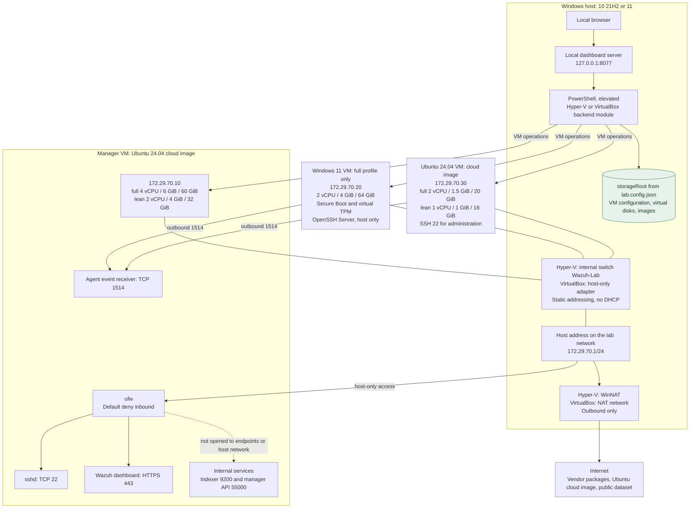

| Connection | Transport | Purpose and implementation boundary |
| --- | --- | --- |
| Browser to local controller | HTTP, loopback TCP 8077 | Local page and JSON API. A per-process `X-Lab-Token` is required for API routes. |
| Host to manager | SSH TCP 22 | Status script, approved service actions, helpers and setup transfers. Manager firewall accepts this from `.1`. |
| Host to native dashboard | HTTPS TCP 443 | Wazuh login, Threat Hunting, Discover and ATT&CK views. Manager firewall accepts this from `.1`. |
| Endpoints to manager | Wazuh agent protocol over TCP 1514 | Events from `.20` and `.30`; agent identities use locally provisioned keys. This is not the HTTPS dashboard path. |
| Filebeat and dashboard to indexer | HTTPS TCP 9200 within manager VM | Index writes and search queries. No host/endpoint firewall allowance is configured. |
| Wazuh dashboard to manager API | HTTPS TCP 55000 within manager VM | Wazuh application and agent-management data. |
| Host to Linux endpoint | SSH TCP 22 | Scenario wrapper, service actions and campaign-record synchronization. The agent installer does not itself impose a host-only SSH firewall on this guest. |
| Host to Windows guest | SSH TCP 22 | Scenario execution, agent enrolment and file transfer. OpenSSH Server is installed from the unattend file and its firewall rule is scoped to the host address. PowerShell Direct is gone: it worked only on Hyper-V, and one transport has to serve both backends. |
| Linux S1 client to temporary sshd | TCP 22222 on guest loopback | Generates real failed SSH logins. The temporary daemon is not bound to the lab network. |
| Guests to package repositories | Outbound HTTPS via NAT | Installation and updates. Seed DNS addresses are `1.1.1.1` and `8.8.8.8`. |

Every number here comes from `lab.config.json` and is summed at run time rather than written down twice. The full profile starts 11.5 GiB of memory across three VMs and can grow to 16 GiB; the lean profile starts 5 GiB across two and can grow to 8 GiB. Memory is dynamic on Hyper-V, with a per-VM floor, so an idle endpoint hands its pages back; VirtualBox has no equivalent and takes what it is given. The manager's floor equals its startup memory on both profiles, so it does not balloon at all. That is deliberate rather than an oversight: the Wazuh installation assistant refuses to install below 3700 MB of usable memory, `free` reports what the balloon left rather than what the VM was created with, and a full-profile manager with all four services up was measured using 3,608 MB. A lower floor was tried on the lean profile and the install failed on the assistant's own hardware check. `install-manager.sh` now makes that check itself, before the apt work, and prints the `Set-VMMemory` line that fixes it. The free-space gate is the sum of the profile's disks plus a quarter, which is 180 GB for the full profile and 60 GB for the lean one, and `Get-LabImage.ps1` wants about 8 GB more while it converts the cloud image. `AutomaticStartAction` is `Nothing` and `AutomaticStopAction` is `ShutDown` on every VM, set at creation and again by the dashboard's start path, which has no code that can write any other autostart value. Checkpoints are standard rather than production, so nothing builds a differencing chain behind an ordinary shutdown.

## 3. Provisioning and configuration dependencies

```mermaid
flowchart LR
    CONFIG[("lab.config.json<br/>Backend, profile, addresses, sizes and versions")]
    PREFLIGHT["Test-LabHost.ps1<br/>Virtualization, hypervisors, RAM and disk against the profile"]
    SECRETS["New-LabSecrets.ps1"]
    PRIVATE[("setup/.lab-secrets<br/>SSH keypair, console password and hash")]
    IMAGE["Get-LabImage.ps1<br/>Fetch, verify against SHA256SUMS, convert"]
    CLOUDIMG[("Prepared Ubuntu cloud image<br/>Under storageRoot, beside the VM disks")]
    WMEDIA["Windows 11 ISO<br/>Full profile only; evaluation image needs no key"]
    GUESTENV["Write-GuestConfig.ps1<br/>lab.config.json as shell assignments"]
    USEED["New-LabSeeds.ps1<br/>Cloud-init NoCloud seeds, one per Ubuntu guest"]
    WSEED["New-WindowsSeed.ps1<br/>Windows answer-file image"]
    CREATE["New-Lab.ps1<br/>Network, VMs, boot disk and seed attached"]
    FIRST["First boot<br/>cloud-init applies account, key, hostname and address"]
    OS["Running guests, labadmin<br/>/etc/wazuh-lab/lab.env in place"]
    MI["install-manager.sh<br/>Version gate, firewall, all-in-one install"]
    TUNE["tune-manager.sh<br/>Indexer heap, disabled modules, index retention"]
    MC["configure-manager.sh<br/>Deploy rules and validate analysisd"]
    KEYS[("Manager client.keys<br/>Per-endpoint key exports")]
    MD["configure-dashboard.sh<br/>Create index pattern and default view"]
    AGENTS["Install-LabAgents.ps1<br/>Collect each key, copy, install on the endpoint"]
    WI["Windows Install-Agent.ps1<br/>Signed MSI, audit policy, config and key"]
    LI["Linux install-agent.sh<br/>APT package, rsyslog, auditd and FIM"]
    READY["Agents enrolled and reporting<br/>Wait for initial FIM baseline"]
    ENABLE["Enable-LabDashboard.ps1<br/>Manager helpers, guest wrappers and sudoers"]
    OPERATE["Lab.cmd<br/>Normal operation"]
    CONFIG --> PREFLIGHT
    CONFIG --> IMAGE
    CONFIG --> GUESTENV
    CONFIG --> CREATE
    PREFLIGHT --> CREATE
    SECRETS --> PRIVATE
    IMAGE --> CLOUDIMG --> CREATE
    GUESTENV --> USEED
    PRIVATE --> USEED --> CREATE
    PRIVATE --> WSEED --> CREATE
    WMEDIA --> WSEED
    WMEDIA --> CREATE
    CREATE --> FIRST --> OS
    OS --> MI --> TUNE
    MI --> MC --> KEYS
    MI --> MD
    KEYS --> AGENTS
    OS --> AGENTS
    AGENTS -->|key delivered, then deleted from the host| WI
    AGENTS -->|key delivered, then deleted from the host| LI
    WI --> READY
    LI --> READY
    READY --> ENABLE --> OPERATE
    MD --> OPERATE
    classDef store fill:#e7f2eb,stroke:#487b60,color:#173b29
    class PRIVATE,KEYS,CONFIG,CLOUDIMG store
```

Configuration details:

- Manager scripts require root, the `wazuh-manager` hostname, and Wazuh packages at `4.14.7-1`. Installation uses the vendor all-in-one assistant after checking its version. Manager, indexer and dashboard packages are held.
- Rules are copied beside the vendor rules to `/var/ossec/etc/rules/wazuh_lab_rules.xml`. A failed `wazuh-analysisd -t` restores the prior rule file or configuration.
- `manage_agents` creates `wazuh-windows` and `wazuh-linux` identities. Keys are transferred privately to the corresponding endpoint `client.keys`; automatic enrollment is disabled and manager `authd` is disabled.
- Windows installation checks the MSI's Wazuh Authenticode signature, backs up configuration and audit policy, installs a Security-event query, restricts key access and starts `WazuhSvc`.
- Linux installation uses the Wazuh APT signing key, pins the agent version, configures audit watches and calls `configure_agent.py`. Logcollector and syscheck configuration checks precede startup.
- Active-response actions are disabled in the endpoint configurations; manager active-response entries are removed. This lab observes and reports.
- `configure-dashboard.sh` resolves fields and creates `wazuh-alerts-*` with time field `timestamp`. It also sets that index pattern as the default and a seven-day default time range.
- OS installation is seeded, but a fresh build is not one command: media attachment, Ubuntu boot setup and agent-key transfer remain part of the procedure. Dashboard bring-up starts an existing lab.

## 4. Endpoint telemetry and real scenario actions

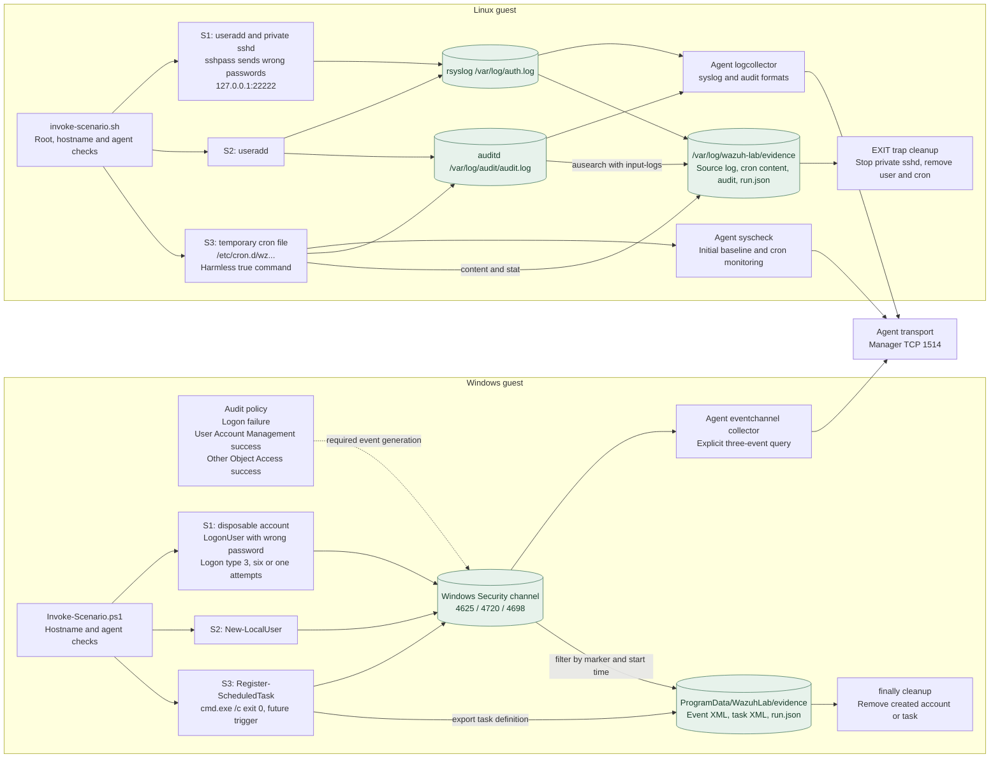

Linux audit watches cover `/etc/passwd`, `/etc/shadow`, `/etc/crontab`, `/etc/cron.d`, the hourly/daily/weekly/monthly directories, and `/var/spool/cron/crontabs`. Cron directories use realtime FIM with content changes; `/etc/crontab` is monitored through scheduled scanning. Linux configuration avoids collecting the same authentication records through both journald and auth.log.

Audit data corroborates the cron change; rule 100113 itself matches FIM output. Account creation is detected from decoded `useradd` output. Additional vendor-default monitoring can remain enabled because the installers preserve unrelated configuration. The six custom cases are the acceptance scope, not the entire installed Wazuh ruleset.

S1 setup creates an account, so it can also produce S2 telemetry. Evidence must therefore match scenario, marker, endpoint, rule and time, rather than assuming every alert during an S1 run belongs to S1. S2/S3 comparison mode performs the same observable action and marks it as approved activity; silence is not the expectation for those comparisons.

## 5. Decoding, rules and alert delivery

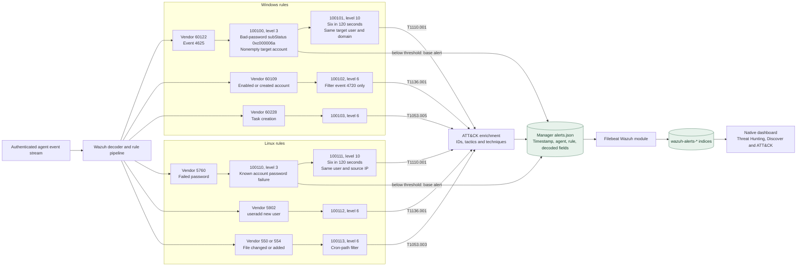

Correlation is per agent because the rules do not enable `global_frequency`. The triggering event produces the composite rather than an additional seed alert, so a six-attempt positive control can appear as five seed alerts plus one composite. Vendor detections continue to operate beside these rules.

There are **eight custom rules**, **six platform/scenario detections**, and **four unique ATT&CK sub-techniques**. S1 already uses time-based correlation. S2 and S3 expose evidence for analyst review and do not establish intent. The recorded 90-day index deletion policy applies to indexed alerts; it is not a blanket retention policy for endpoint evidence, model datasets or every manager log.

## 6. Local dashboard, API and operating controls

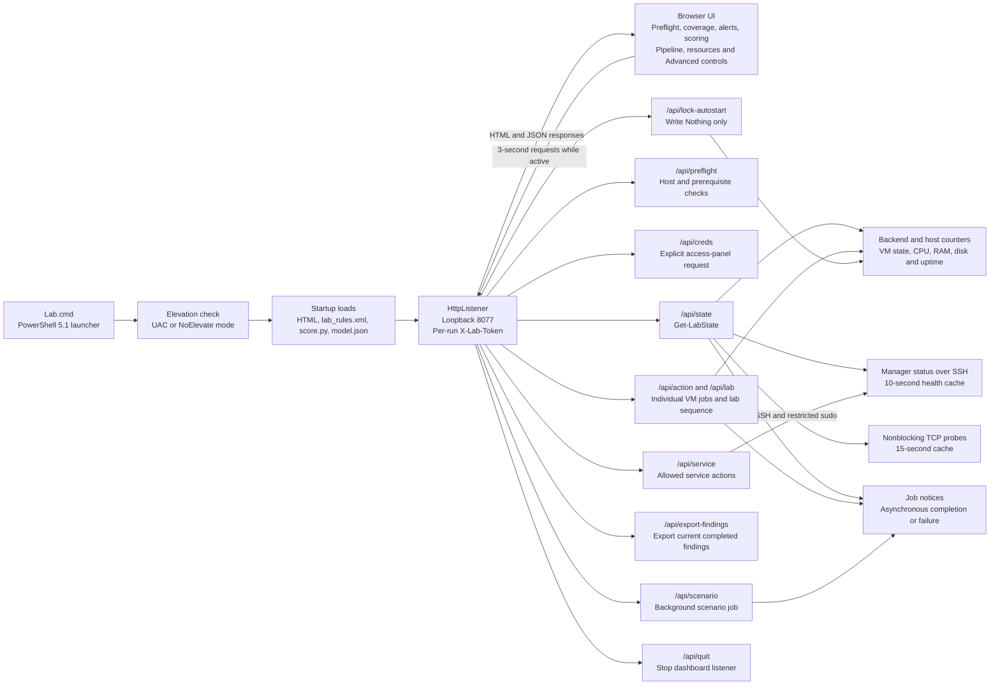

| API route | UI request | Operation |
| --- | --- | --- |
| `/api/state` | GET | Resources, VM state, probes, cached manager data, scoring, job notices and sequence progress. |
| `/api/preflight` | GET | Checks elevation, virtualization, Hyper-V, switch/NAT, VM presence, credentials, SSH and required files. |
| `/api/creds` | GET | Reads guest console access locally and the Wazuh login through its manager helper. Values are masked by default in the page. |
| `/api/action` | POST | `start`, `shutdown`, `restart`, or `forceoff` for a known VM. |
| `/api/service` | POST | `start`, `stop`, or `restart` for named manager units or the Linux agent. Windows agent service control is rejected here. |
| `/api/lab` | POST | `up`, `down`, or `cancel` for the multi-VM sequence. |
| `/api/scenario` | POST | One of S1/S2/S3 in test/comparison mode on Windows or Linux. |
| `/api/export-findings` | POST | Builds an HTML findings document and prints it to PDF. |
| `/api/lock-autostart` | POST | Sets the three VMs to `AutomaticStartAction Nothing`. |
| `/api/quit` | POST | Stops the controller, not a lab shutdown operation. |

The table describes frontend request conventions. The server dispatches most API routes by path after checking the token; it does not explicitly enforce an HTTP verb on every route. There is no CORS allowance. The listener is a local single-user administration tool, not a multi-user application server.

Browser polling normally pauses when the tab is hidden or the user pauses it. An active bring-up/down sequence keeps polling because requests advance its state machine. The controller loads rule inventory and scorer files at startup; changing those files requires a controller restart to refresh the loaded snapshot.

The manager payload returns `services`, `agents`, `alerts`, `coverage`, `attack`, `rate`, `log`, `window`, `disk`, `indexer`, `scoring`, and `missing`. Coverage joins the host's intended rule inventory with matches in the sampled alert tail. It does not prove full historical coverage. Recent alerts are limited to 50, and the UI can display 5, 10, 15, 25 or 50.

## 7. Lab lifecycle and privileged execution

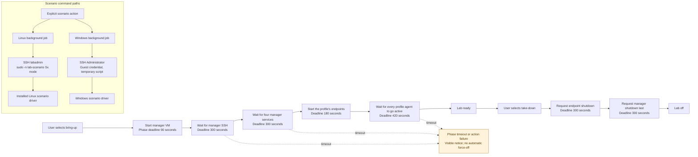

The sequence is request-driven, not a permanently running scheduler. Pausing/cancelling it does not reverse completed power actions. Starting the dashboard alone never starts VMs. Individual Force off is a separate explicit operation.

`Enable-LabDashboard.ps1` installs these guest capabilities:

| Guest | Read capability | Privileged helper or allowed action |
| --- | --- | --- |
| Manager | `labadmin` joins `wazuh` to read alerts and manager logs | `agent_control -l`; start/stop/restart of `wazuh-manager`, `wazuh-indexer`, `wazuh-dashboard`, `filebeat`. |
| Manager | Indexer health, document totals, size and retention state | `/usr/local/bin/lab-dashboard-indexer`, using local indexer admin certificate files. |
| Manager | Wazuh dashboard access details on explicit request | `/usr/local/bin/lab-dashboard-creds`, reading the root-owned installer log. |
| Linux endpoint | `labadmin` joins `wazuh` | Agent service control, six exact `lab-scenario` invocations and three `lab-campaign` verbs. |

The installed scenario wrapper calls `/usr/local/lib/wazuh-lab/invoke-scenario.sh`. Sudoers content is validated with `visudo -c -f` before installation, so a malformed file is never written. `lab-campaign` is granted alongside it as three named verbs, `start *`, `stop` and `status`, rather than as a path with a wildcard argument list; the wrapper itself refuses anything but a whole number of hours. Windows scenario jobs read the local console credential when invoked and reach the guest over SSH.

Current transport caveats belong in the architecture: several administration helpers disable SSH host-key verification and do not retain known hosts; dashboard/indexer helper queries use `curl -k`. These are existing lab choices, not a claim of fully verified server identity. Credential values are deliberately excluded from these diagrams.

## 8. Dataset ingestion, training and model export

```mermaid
flowchart LR
    AIT["AIT archive and labels.csv<br/>Eight controlled enterprise networks"]
    IMPORT["import-ait.py<br/>Parse native alerts and ground truth"]
    CACHE[("Per-source parsed cache<br/>Sorted timestamps and rule IDs")]
    WINDOWS["300-second episodes<br/>Anchored to first capture alert<br/>Retain up to 256 alerts per episode"]
    EPS[("episodes.jsonl and vocab.json<br/>Source, label, time, alerts")]
    SYN["make-synthetic.py<br/>Fabricated lab-rule episodes"]
    FUTURE["PENDING<br/>Labelled lab-alert exporter"]:::pending
    SPLIT["features.py<br/>Time/source splits and vocabulary<br/>Unknown-rule bucket"]
    COUNTS["tabular features<br/>Rule counts, unknown count<br/>Volume and timing"]
    SHAPE["shape_only features<br/>Eleven volume, timing<br/>and severity measurements"]
    SEQ["Sequence tensors<br/>Rule tokens and log time gaps<br/>Padding and lengths"]
    BASE["baseline.py<br/>Single rule, always-attack<br/>NumPy logistic regression"]
    GRU["train.py / AlertGRU<br/>Embedding 16, GRU 32<br/>Dropout and two-class head"]
    EVAL["evaluate.py<br/>Eight outer held-out networks<br/>Three GRU seeds per fold"]
    FOLDS[("data/ait/folds.jsonl<br/>Per-model F1 and AP")]
    PT[("models/alert_gru_*.pt<br/>Offline experiment only")]
    EXPORT["export-model.py<br/>Fit portable logistic on seven networks<br/>Select cutoff on Wilson"]
    PARITY["Feature parity check<br/>features.py versus scorer/score.py"]
    MODEL[("scorer/model.json<br/>Columns, means, scales, weights<br/>Bias, cutoff and provenance")]
    DASH["Dashboard startup<br/>Embeds score.py and model.json"]
    AIT --> IMPORT --> CACHE --> WINDOWS --> EPS
    SYN --> EPS
    FUTURE -.-> EPS
    EPS --> SPLIT
    SPLIT --> COUNTS --> BASE
    SPLIT --> SHAPE --> BASE
    SPLIT --> SEQ --> GRU --> PT
    COUNTS --> EVAL
    SHAPE --> EVAL
    SEQ --> EVAL --> FOLDS
    EPS --> EXPORT
    FOLDS --> EXPORT
    EXPORT --> PARITY --> MODEL --> DASH
    classDef pending fill:#fff3db,stroke:#a66516,color:#533600
    classDef store fill:#e7f2eb,stroke:#487b60,color:#173b29
    class CACHE,EPS,FOLDS,PT,MODEL store
```

The saved public-data run parses 2,600,263 raw alerts into 8,932 five-minute windows, 188 of them attack-labelled, keeping 1,007,412 alerts after the per-window cap. That cap is 4,096 and it binds 26 windows, every one of them attack-labelled: the AIT scenarios contain flood phases above a hundred thousand alerts in five minutes, and those 26 windows alone hold 1.70M of the 2.60M. The cap is set against the live ceiling rather than against this data, because one indexer search returns at most 5,000 documents and a training window must not claim a count the panel could never produce. An episode is labelled by overlap with a ground-truth phase; this does not mean every alert inside it is malicious. Public data evaluates a method on different rules, not these six custom detections.

Model mechanics:

- **Single-rule baseline:** choose a rule on available training data, then classify whether it appears in an episode.
- **Full logistic:** per-rule counts, unknown count and six volume/timing values; standardized inputs, NumPy batch gradient descent, logistic loss and L2 regularization. Defaults are 3,000 fitting iterations, learning rate 0.15 and L2 0.001.
- **Portable logistic:** eleven aggregate features, with no per-rule count columns. This is the deployed scorer; the full logistic and GRU remain offline comparisons.
- **GRU:** 16-dimensional rule embedding plus one gap feature, a 32-unit GRU, dropout 0.2 and a linear two-class head. Training uses class-weighted cross entropy and Adam. The eight-fold evaluator defaults to maximum sequence length 128, batch size 256, 60 epochs, learning rate 0.003 and three seeds. `train.py` has separate defaults and writes the `.pt` checkpoint.
- **Evaluation:** each outer test network is excluded from model fitting, and inside the remaining seven one whole network is held back for thresholds and early stopping, rotated so each validates exactly once. Standardization, vocabulary and weights are fitted on the inner split alone. Average precision cuts the curve only where the score changes, so tied scores no longer make the number depend on row order. All three of those were defects found in review and corrected; every figure downstream was recomputed rather than carried over.
- **Export:** the exported portable model uses seven complete networks for fitting and Wilson for threshold selection. It checks feature parity before writing the model, refuses to write if `score.py` and `features.py` disagree, and embeds the saved eight-fold measurements alongside the adaptive layer's own measured comparison.

The model output is a supervised logistic score for the experiment's attack label. It is not an independently calibrated probability of compromise, and it is not proof that an event is unusual in this lab. What each endpoint normally does is a separate thing, learned on the manager rather than here, and it scales the severity rather than the probability: diagram 9 is where that lives.

## 9. Manager-side scoring and severity calculation

```mermaid
flowchart LR
    HOST["Host loads score.py and model.json<br/>Once at dashboard startup"]
    ENCODE["Substitute into status script<br/>Base64-encode payload"]
    SSH["SSH: execute Python from stdin<br/>On manager, as labadmin"]
    SEARCH["lab-dashboard-indexer alerts N<br/>Authenticated search over mTLS, 90 minutes"]
    TAIL["Fallback: alerts.json tail<br/>Last 400 KB, at most 800 lines, flagged truncated"]
    PARSE["Parse timestamp, rule, level, agent<br/>Tactics, techniques and description"]
    BUCKET["Epoch-aligned five-minute buckets<br/>Split per endpoint"]
    FEATURES["Eleven aggregate features"]
    STANDARD["Standardize with saved mean and SD"]
    LOGISTIC["Dot product plus bias<br/>Clamp logit and apply sigmoid"]
    OBS["Completed windows that have scrolled off the chart<br/>Count, peak, mass, burst, distinct, probability, rules"]
    BASEH["lab-dashboard-baseline<br/>Prints the state before folding these in"]
    BASE[("/var/lib/wazuh-lab/baseline.json<br/>Per endpoint: samples, hours, rules")]
    DEN["Four of six denominators from this endpoint<br/>Median plus three robust SD, floored at the fixed value"]
    NOV["Novelty and routine<br/>Rules new to the endpoint up, its daily traffic down"]
    HEURISTIC["Six-term severity, per endpoint<br/>Model is one component"]
    CO["Credential and persistence on one endpoint<br/>Tactics or lab rule IDs<br/>Multiplier from 1.15 to 1.30"]
    WARM["Under 24 windows: fixed constants stand<br/>The panel says which mode it is in"]
    PARTIAL["Current logic: newest event bucket<br/>Marked partial until later event arrives"]:::pending
    DISPLAY["Last twelve nonempty buckets<br/>Worst endpoint leads, every endpoint reported"]
    FIND["Completed bucket with severity at least 50<br/>Ranked finding and rule breakdown"]
    JSON["Status JSON over SSH<br/>Cached on host for 10 seconds"]
    PAGE["Browser chart and explanations"]
    PDF["Explicit findings export request"]
    LIMIT["KNOWN LIMITS<br/>Chain multiplier is untested on public data<br/>Both severity arms rank below the model term on AIT<br/>Order within a chain is still not checked"]:::pending
    HOST --> ENCODE --> SSH --> SEARCH --> PARSE
    SSH -.->|helper absent or refused| TAIL -.-> PARSE
    PARSE --> BUCKET
    BUCKET --> FEATURES --> STANDARD --> LOGISTIC --> HEURISTIC
    BUCKET --> OBS --> BASEH
    BASEH <--> BASE
    BASEH -->|state as it stood before these windows| DEN
    BASEH --> NOV
    DEN --> HEURISTIC
    NOV --> HEURISTIC
    WARM -.->|gates the whole adaptive layer| HEURISTIC
    BUCKET --> CO --> HEURISTIC
    BUCKET --> PARTIAL
    HEURISTIC --> DISPLAY
    PARTIAL --> DISPLAY
    DISPLAY --> FIND
    DISPLAY --> JSON --> PAGE
    FIND --> JSON
    PAGE --> PDF
    CO -.-> LIMIT
    HEURISTIC -.-> LIMIT
    classDef pending fill:#fff3db,stroke:#a66516,color:#533600
    classDef store fill:#e7f2eb,stroke:#487b60,color:#173b29
    class BASE store
```

The manager needs only Python's standard library for inference. NumPy and PyTorch stay on the modelling workstation. Nothing is installed as a scoring daemon, and no separate inference port is opened. The current scorer runs only when the controller refreshes manager health; the browser's faster polling can reuse cached results.

### Feature contract

| Order | Model column | Calculation |
| --- | --- | --- |
| 1 | `n_alerts` | Number of alerts in the sampled bucket. |
| 2 | `duration_s` | Last alert time minus first alert time; zero for a singleton. |
| 3 to 5 | `min_gap_s`, `median_gap_s`, `max_gap_s` | Gaps between consecutive sorted alerts; a singleton uses zero. |
| 6 | `busiest_60s` | Maximum alerts within any half-open 60-second interval. |
| 7 | `n_distinct_rules` | Number of distinct rule IDs, without separate identity-specific columns. |
| 8 to 9 | `max_level`, `mean_level` | Maximum and mean Wazuh rule severity. |
| 10 to 11 | `n_level_ge_7`, `n_level_ge_10` | Counts meeting those severity thresholds. |

For features `x`, stored means `mu`, scales `sd`, coefficients `w` and bias `b`:

```text
z = b + sum(w[i] * (x[i] - mu[i]) / sd[i])
p = 1 / (1 + exp(-clamp(z, -30, 30)))
```

A zero scale is treated as one. The exported cutoff is currently `0.852048`; the model flag uses `p >= cutoff`. Column order must match the scorer's contract. The runtime loads its embedded model at process startup; it does not train on new events.

### Severity contract

Each normalized component is clamped to `[0, 1]`. Let `n` be alert count, `L` each rule level, `q` the number of inferred or recorded tactics/stages, and `t` the model cutoff.

| Component | Weight | Normalization in current code |
| --- | --- | --- |
| Model | 0.28 | `p / (2 * t)`; this is not distance beyond the cutoff despite the existing UI wording. |
| Peak | 0.18 | `(max(L) / 15)^1.2`. |
| Mass | 0.16 | `sum(2^((L - 7)/2) for L >= 7) / 12`. |
| Velocity | 0.12 | `busiest_60s / max(8, 0.5 * n)`. |
| Breadth | 0.10 | `(distinct_rule_count - 1) / 5`. |
| Coverage | 0.16 | `q / 3`. |

```text
base = 100 * sum(weight * normalized_component)
multiplier = 1
if credential activity and persistence both occur:
    multiplier = 1 + 0.30 * (0.5 + 0.5 * normalized_coverage)
severity = min(100, base * multiplier)
```

Bands are informational below 25, low from 25, elevated from 50, high from 70 and critical from 85. Findings are completed displayed buckets with **severity at least 50**, independently of whether `p` exceeds the model cutoff. A high heuristic finding can therefore have a model score below its threshold.

The co-occurrence test does not establish event order, shared account, or common endpoint. The current implementation discards agent identity before scoring. Its weights and bands are design choices rather than fitted or validated risk estimates. Latest-bucket completion and truncated-history handling remain unresolved, so a screenshot of this panel is not equivalent to validated model performance.

## 10. Campaigns, source evidence and acceptance

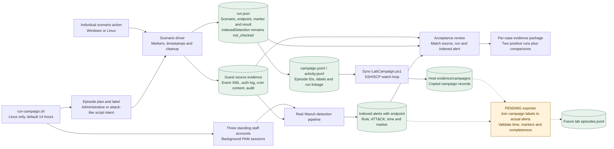

Campaign episode types are `admin-failed-login`, `admin-new-account`, `admin-new-cronjob`, `admin-provision`, `bruteforce`, `bruteforce-persist` and `quiet-persist`. S1 comparison counts are 1 to 5; positive campaign bursts use 6 to 14. The scenario driver supports an optional count up to 20. The runner spaces S1 runs by at least 150 seconds and waits three minutes after staff setup before recording.

`start` detaches the campaign; `status` reports records; `stop` requests cleanup after the current episode. `simulate` prints a schedule without producing endpoint events. Background sessions are part of the scripted lab workload, not personal desktop activity. Campaign labels express planned test intent, not independent proof of malicious activity.

The one-hour pilot is recorded historically, but the local synced evidence is partial. A full campaign and a completed alert-joining exporter are still needed before this path supplies a measured lab-specific model dataset. Copying labels alone does not preserve the corresponding indexed features.

Acceptance follows R1 to R5: source fields exist, all six detections repeat, alerts preserve useful context and timing, comparisons behave as intended, and configuration plus evidence permit review. Linux frequency expiry and cross-agent checks have recorded results. Equivalent Windows edge cases and sustained-load checks remain open. The existing offline rule suite records six passes and nine errors; it is not a fully passing substitute for live endpoint validation.

## 11. Reports, verification and artefact ownership

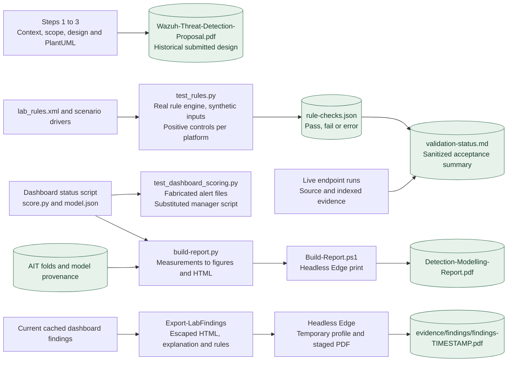

Reports have different evidentiary roles. The proposal records an earlier decision. The modelling report summarizes public-data experiments. A findings PDF snapshots selected dashboard buckets, their rules and heuristic calculations. It does not certify a confirmed incident or compensate for an incomplete sample.

The report builder uses saved measurement artefacts and a generated `figures.json`; changing documentation text alone does not correct the underlying evaluation. Findings export relies on a fresh or cached manager response and uses a temporary Edge profile. It writes under the ignored evidence directory. No email or external sharing is performed by these builders.

### Source and storage map

| Location | Responsibility / contents | Lifecycle |
| --- | --- | --- |
| `Lab.cmd` | Entry point for normal host dashboard operation. | Versioned source. |
| `lab.config.json` | Backend, profile, addresses, sizes and versions: the one place they are written down. | Versioned source. |
| `docs/design/` | The coursework the build started from: context, scenarios, acceptance requirements and the proposed stack, with the PlantUML context diagram. | Historical design, written before the build. |
| `setup/` | Host preflight, secrets and seed builders, image fetch, provisioning, agent enrolment and teardown. | Versioned tooling. |
| `setup/backends/` | One twelve-function contract, implemented for Hyper-V and for VirtualBox. | Versioned tooling. |
| `dashboard/` | PowerShell server, HTML UI, launcher and guest-permission setup. | Versioned application. |
| `.lab-secrets/` | SSH keys, console credentials and installation seeds. | Local only; excluded from Git. |
| `manager/` | Pinned installation, rule deployment, native dashboard setup and custom rules. | Versioned configuration. |
| `agents/windows/` | Windows agent installer and real-event scenario driver. | Versioned guest tooling. |
| `agents/linux/` | Linux agent configuration, scenario driver and campaign runner. | Versioned guest tooling. |
| `tests/` | Engine acquisition/setup, rule tests, frequency checks and dashboard-scoring tests. | Development verification; not runtime services. |
| `evidence/` | Live runs, campaigns, findings and test outputs. | Raw files ignored; README and validation status are versioned. |
| `scoring/` | Dataset contract, import/generation, features, baselines, GRU, evaluation and export. | Offline workstation code. |
| `scoring/data/` | Public archives, parsed caches, episodes and folds. | Generated or downloaded; ignored. |
| `scoring/models/` | PyTorch checkpoints. | Offline experiments; ignored. |
| `scoring/scorer/` | Standard-library inference code and portable JSON weights/provenance. | Versioned deployment artefacts. |
| `scoring/report/` | Report template, figures and builders. | Source and measurements; generated report HTML ignored. |
| `docs/` | Proposal, model report, the build guide and this architecture. | Reviewable project documentation. |
| `docs/architecture/*.mmd` | The eleven diagrams, and the only place they are edited. | Versioned source. |
| `.cache/` | Downloaded engine packages and other build intermediates. | Ignored local cache. |
| Manager `/var/ossec/etc/` | Runtime rules, main configuration and agent identity keys. | Guest operational configuration. |
| Manager `/var/ossec/logs/` | Alert stream and manager logs. | Guest operational data. |
| Manager `/etc/wazuh-indexer/certs/` | Indexer certificates and helper client credentials. | Guest private configuration. |
| Manager `/var/lib/wazuh-lab/` | Per-endpoint baseline: what each one normally does, folded one completed window at a time. | Guest operational state. |
| Manager `/usr/local/bin/lab-dashboard-*` | Root-owned helpers the dashboard is granted by exact path: indexer search, baseline, credentials. | Guest operational tooling. |
| Manager `/root/wazuh-lab-install/` | Vendor installation artefacts and credential-bearing log. | Guest private setup data. |
| Windows `%ProgramData%/WazuhLab/` | Audit/config backups and per-run source evidence. | Guest local evidence. |
| Linux `/var/log/wazuh-lab/` | Setup logs, per-run evidence and campaign records. | Guest local evidence. |

### Failure and update behaviour

- A missing or unreadable manager capability is returned through `missing` or an unreachable status. The UI must distinguish unavailable telemetry from zero alerts.
- A missing model leaves the other dashboard functions available. Model-column mismatch prevents ordinary scoring. The current runtime embeds the scorer rather than deploying an independently versioned service.
- Source-event capture can fail even when a scenario command succeeds. A successful source capture still leaves `indexedDetection` unverified until the alert is matched.
- VM/scenario jobs report completion later through job notices. A successful HTTP action response generally means the action was requested, not that its detection has been accepted.
- Rule changes require manager deployment and validation; host coverage inventory requires controller restart. Linux scenario changes also require refreshing the installed guest copy used by the wrapper.
- Agent disconnection, queue capacity, log rotation, indexer recovery and sustained load rely on vendor/runtime behaviour. This project has no separate durable event broker, model database or high-availability deployment, and has not demonstrated those failure conditions.

### Verification boundary

The original six detection cases have historical live evidence. The latest model panel has offline checks and recorded UI testing, but its live scenario acceptance remains open. Metric ties, inner validation splitting, sampling completeness, quiet-window closure and co-occurrence naming remain known issues. They are represented as current implementation limits throughout these diagrams rather than silently drawn as completed improvements.

This architecture was traced from the scripts and configurations above. Host resources, addresses and deployment status reflect the recorded lab; the document is not an inventory scan of currently running machines.
