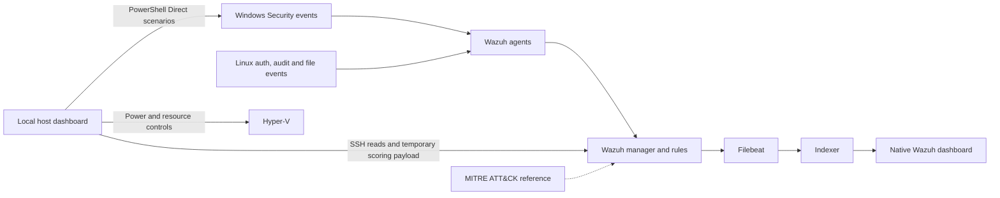

# Wazuh project handoff review

Reviewed on 21 September 2026 against the supplied Claude exports and the current local repository.

The project has progressed well beyond the last implementation state in this Codex conversation. The historical record supports a working Windows and Linux Wazuh lab, six demonstrated detection cases, a local control dashboard, and an additional modelling experiment. There is no reason to restart the build. The remaining work is a focused correctness and evidence pass, especially around the newer scoring panel.

This review did not start VMs, connect to guests, change credentials, run campaigns, train models, or push changes. Historical commands and requests in the exports were treated as context. Current VM power state and service health were not rechecked.

## 1. What the handoff establishes

| Area | State supported by the record | Limit to preserve |
| --- | --- | --- |
| Steps 1 to 3 | Submitted context, scope and technical proposal, with a PlantUML context diagram | These are historical design records. Some later annotations and summaries still conflict. |
| Core implementation | Three Hyper-V guests, Wazuh 4.14.7, enrolled Windows and Ubuntu endpoints | Windows is the host platform. Linux support is demonstrated with Ubuntu guests, not a portable Linux host launcher. |
| Six detection cases | Two live rounds reported, with actual second-round tool outputs in the PDF | The local evidence directory does not contain a complete, independently reusable bundle for both rounds. |
| Delivery | Indexed alerts, ATT&CK fields and dashboard queries appear in recorded output | Historical verification does not establish that services are running now. |
| Central dashboard | Power sequencing, resources, preflight, scenarios, credentials and operational panels implemented | The later model panel has not been watched against a live scenario. |
| Modelling | AIT import, logistic baselines, PyTorch GRU, eight-fold evaluation and exported portable model exist | Published metrics have a calculation issue; lab-specific detection performance remains unmeasured. |
| Reporting | Original proposal PDF, modelling report and findings-export code exist | The conversation PDF labelled Shareable still exposes a historical credential. |
| Repository | Local `main` is at `e46fe8e3c29496c67ff75f9f87d10aea1aafaa60`, matching the local `origin/main` reference | Initially clean. New untracked progress-report files appeared during review; see below. No remote fetch was performed. |

The main project handover is [PROJECT-STATUS.md](<C:/Users/PC/Desktop/cybersec intern/wazuh-threat-detection/PROJECT-STATUS.md>). Its opening description that only packaging remains is broader than its own list of unfinished work.

## 2. Timeline and changes in direction

- **7 September:** Steps 1 to 3 revised, rendered and sent as the proposal. This was still a design exercise.
- **11 September:** Actual Hyper-V deployment, Windows and Linux agent setup, six live detections, indexing and presentation checks. Linux frequency-window expiry and separation between agents were tested with controls. A small host dashboard was added.
- **17 September:** The user explicitly made that dashboard the central project interface. Repository bootstrap and power controls were added. A one-hour Linux campaign pilot began, and modelling work was introduced after the mentor mentioned PyTorch.
- **20 to 21 September:** Public AIT data was used for model comparison. Guest dashboard permissions were successfully configured. Portable logistic scoring, a custom severity score, explanations and findings export were integrated. Offline panel checks were completed; the final live panel demonstration remained pending.

The later requests supersede the original preference for using only Wazuh's existing frontend. The local control dashboard is an intentional extension. The modelling stage is also beyond the original four-step brief.

## 3. Architecture and scope to carry forward

| Guest | Address | Role |
| --- | --- | --- |
| WAZUH-MANAGER | 172.29.70.10 | Ubuntu, Wazuh manager, Filebeat, indexer and native dashboard |
| WAZUH-WIN | 172.29.70.20 | Windows 11 endpoint, agent 001 |
| WAZUH-LINUX | 172.29.70.30 | Ubuntu 24.04.5 endpoint, agent 002 |

The host is the gateway at 172.29.70.1, with an internal Hyper-V switch and NAT. The recorded fixed RAM allocation is 8 + 6 + 2 GB. VM autostart is disabled. Storage is under `D:\Wazuh-Lab`.

The local dashboard runs at `127.0.0.1:8077`; the native Wazuh interface is at `https://172.29.70.10`. The new scorer reads the manager's alert-log sample during the existing poll. It is not installed as a replacement Wazuh detection engine.

| Case | Windows rule | Linux rule | ATT&CK |
| --- | --- | --- | --- |
| S1: six incorrect passwords within 120 seconds | 100101 | 100111 | T1110.001 |
| S2: local account creation | 100102 | 100112 | T1136.001 |
| S3: scheduled task or cron-path change | 100103 | 100113 | T1053.005 / T1053.003 |

There are six platform/scenario cases, four distinct ATT&CK IDs, and eight custom rules including two seed rules. A single failed password can still produce a low-level seed alert; the comparison tests establish absence of the repeated-failure alert. S2 and S3 observe behaviours that can also be legitimate administration. A cron-path change does not establish execution or malicious intent.

The existing context diagram remains useful for the original detection path. Its pending-review note is historical, and it does not represent the later host dashboard or model. Keep it as a dated proposal diagram and add a current implementation view rather than silently treating it as the complete architecture.

## 4. What the evidence proves, and what is missing

The PDF adds material evidence absent from the shorter Markdown transcripts:

- Shareable PDF pages **237 to 238** contain second-round scenario results and threshold checks for both operating systems.
- Page **244** contains an indexed Windows S1 alert with its rule, endpoint and ATT&CK fields, alongside the recorded 47-document index verification.
- Page **295** contains the Linux cross-agent query output confirming identical source/account fields and a threshold alert only on the agent that reached six failures.
- The local `evidence/dashboard-check.txt` records successful Discover, ATT&CK aggregation and manager API checks.

This supports the history of a real lab. It is stronger than an assistant's completion statement alone.

The local evidence bundle still needs work. Its run manifests cover only the first round, including an earlier failed Linux S3 procedure, and retain `indexedDetection: "not_checked"`. The Windows summary concatenates JSON objects rather than providing one valid JSON document or JSONL stream. Second-round source records and matching indexed alerts should be assembled into a consistent evidence bundle.

The stored offline rule result is **6 pass, 0 fail, 9 error**, not a fully passing suite. Windows positive-control routing was unavailable to that harness, and the limitations are documented. Live endpoint evidence is the relevant validation for those cases.

The one-hour campaign was a pilot. The local synced capture holds only three benign episodes and a stale `running: true` state. It does not establish that a campaign is running now or that a useful training dataset has been collected. The 14-hour campaign and the exporter joining scenario labels to indexed alerts remain unfinished.

Windows frequency expiry/separation checks and sustained-load testing also remain open. The Linux checks do not directly validate the Windows rule's different correlation fields.

## 5. What the modelling stage actually found

The saved measurement artefacts describe **2,600,263 Wazuh alerts**, **8,915 five-minute episodes**, and **187 attack-labelled episodes** from eight simulated enterprise networks in the AIT dataset. These are real security-platform outputs from a controlled dataset. They are separate from this lab's own scenario evidence and from the fabricated inputs used to test the code.

| Method | Recorded mean average precision |
| --- | --- |
| Single-rule comparator | 0.161 |
| Portable logistic model | 0.177 |
| PyTorch GRU | 0.199 |
| Logistic model using rule counts and timing | 0.249 |

These are the stored results, subject to the metric correction below. The recorded full logistic model beats the tested GRU in all eight folds. That supports preferring this simpler model for this experiment, not a universal conclusion that sequence models or PyTorch are unsuitable for threat detection.

The dashboard uses a different, portable logistic model with eleven count, timing and severity features. The exported weights were fitted on 7,639 episodes from seven networks; its cutoff was chosen on 1,276 episodes from Wilson. Evaluation across eight held-out networks is distinct from training this one exported model. Its performance on this lab remains unknown.

The displayed **0 to 100 severity** is a separate hand-weighted heuristic. It combines model output, peak rule level, alert mass, burstiness, signature breadth and ATT&CK-stage coverage, then adds a co-occurrence multiplier. Findings are selected when this severity reaches 50, even if the model output is below its own cutoff. The benchmark AP does not validate this composite severity formula or its findings threshold.

## 6. Corrections needed before relying on the new panel

| Priority | Finding and evidence | Required outcome |
| --- | --- | --- |
| Before sharing | **The Shareable PDF contains the historical Wazuh admin password on page 314.** An exact in-memory comparison confirmed the value from the original Markdown. | Redact the missed value in all intended share copies and verify the result. If the export has already left trusted storage, rotate the affected password. No credential was reproduced in this review. |
| Before citing final metrics | [features.py:251](<C:/Users/PC/Desktop/cybersec intern/wazuh-threat-detection/05-detection-modelling/features.py:251>) ranks equal scores by input order. Binary single-rule scores therefore get order-dependent AP. Grouping ties on the saved data gives approximately **0.164473**, versus stored **0.160756**. | Correct tie handling and recompute affected metrics and reports. The observed baseline correction alone does not reverse the portable-model comparison. |
| Before citing validation independence | [evaluate.py:60](<C:/Users/PC/Desktop/cybersec intern/wazuh-threat-detection/05-detection-modelling/evaluate.py:60>) claims a whole-network validation holdout but takes an 85% row cut. It splits a network in all eight folds. Scaling is fitted before that inner split. | Hold out complete validation networks and fit preprocessing on training only. Outer test networks are already separate; this is not evidence that their labels leaked. Recompute with invalidated cached results. |
| Before live scoring acceptance | [Start-LabDashboard.ps1:195](<C:/Users/PC/Desktop/cybersec intern/wazuh-threat-detection/04-implementation/host/lab-dashboard/Start-LabDashboard.ps1:195>) reads the last 400 KB and at most 800 records. The oldest bucket can be truncated but treated as complete. At line 311, the newest alert determines which bucket is partial, so a quiet completed bucket never closes until another alert arrives. | Track sample completeness and use manager time to close windows. Test truncation, quiet periods and gaps explicitly. |
| Before claiming an attack chain | [score.py:193](<C:/Users/PC/Desktop/cybersec intern/wazuh-threat-detection/05-detection-modelling/scorer/score.py:193>) checks credential and persistence activity anywhere in a window. The dashboard drops endpoint identity while bucketing. | Either describe this as co-occurrence or implement explicit temporal and identity relationships. Unrelated activity on different endpoints currently earns the same bonus. |
| Before comparing training and live scores | [import-ait.py:158](<C:/Users/PC/Desktop/cybersec intern/wazuh-threat-detection/05-detection-modelling/import-ait.py:158>) anchors windows to the first capture event and retains at most 256 events per window. Live scoring uses epoch boundaries and a global tail limit. | Define and apply one sampling/window contract, or measure the effect of the difference. Matching feature names is insufficient. |
| Before calling the build reproducible | The recorded 90-day retention policy is absent from the manager setup scripts. Bare-ISO deployment still involves manual steps. | Add the live retention configuration to the reproducible setup and distinguish existing-VM startup from fresh deployment. |

## 7. Documentation and export findings

Several statements need reconciliation rather than another broad rewrite:

- The root README says all six rules judge events individually. S1 already correlates events over time.
- The root README points to the third model row as portable; the portable model is the second row.
- Step 2 says modelling found that a model does not beat the rules. The recorded result is that full logistic beats the single-rule comparator and the tested GRU.
- The modelling README still contains the older recall 0.225 / 917-false-positive discussion. The status file and report artefacts use the corrected Wheeler example: recall 0.375 with zero false positives, or recall 0.5 with 119 false positives. It also reverses the threshold direction when describing increased recall.
- Phrases such as "all six techniques", "running live", and "only packaging remains" need the narrower distinctions recorded above.

All eleven supplied files were considered: the index, three session transcripts, combined prompts, two PDFs and four export/audit scripts. Text was extracted from all **1,420 raw PDF pages** and **1,418 shareable PDF pages**. Relevant evidence pages were inspected and representative cover/scoring pages were visually checked. This was not a visual inspection of every page or an OCR audit of every screenshot.

The exports have provenance limits:

- The index describes three sessions and 95 screenshots; the PDF cover reports four sessions and 96 screenshots. The extra material includes the export workflow. These are not identical inventories.
- The Markdown deliberately omits full tool output. `all-prompts.md` contains duplicated historical material and system task notifications, so it is an aid to chronology rather than a clean authoritative list of user decisions.
- `render_full.py` applies a few text regexes before Markdown rendering. The bold/code-formatted password bypasses them. Images are embedded unchanged, and the unconditional "Safe to share" statement is unsupported.
- `audit.py` scans UTF-8 text patterns, not PDF content directly or screenshot pixels. Its matches include code identifiers and public keys, so its count is not a count of confirmed live secrets.
- `render_transcript.py` deduplicates some queued content using only a text prefix. Neither exporter can restore content that a tool result already truncated. The PDFs themselves contain such truncation markers.
- `Build-ChatPdf.ps1` is an export utility, not part of the Wazuh implementation. It removes an existing output before replacement succeeds. It was reviewed, not executed.

At the final repository check, two new untracked paths had appeared: `docs/Wazuh-Lab-Progress-Update.pdf` and `docs/progress-update/`, timestamped around 16:32. This review did not create or modify them. The new five-page PDF was text-checked and repeats the same metric, single-event-rule and chain claims identified above. Its live-scoring section also needs the distinction between offline panel checks and a live scenario demonstration. Its layout was not reviewed. These files are additional to the eleven supplied handoff files and are not part of the recorded pushed commit.

## 8. Recommended continuation

1. Correct the shareable export and retain the raw archive privately.
2. Fix the metric, validation and scoring-window issues. Resolve whether the bonus means co-occurrence or a linked sequence. Recompute affected measurements and regenerate the modelling report.
3. Run a bounded live acceptance pass: both endpoints, scoring during a real scenario, completion after a quiet window, findings export and Windows correlation edge cases. Save source records and indexed matches together.
4. Reconcile the status, scope, diagram and report claims with those results. Make retention reproducible. Treat the full campaign and lab-specific model evaluation as separate follow-on work.

Continue to preserve the user's established constraints: personal homelab, Windows priority, Ubuntu demonstration, no VM autostart, real endpoint events, concise natural documentation, and no inflated claims about malicious intent or model accuracy.

The immediate continuation is a correctness and evidence pass on the existing implementation. The historical deployment blocker in this Codex thread has been superseded by the later build record.
